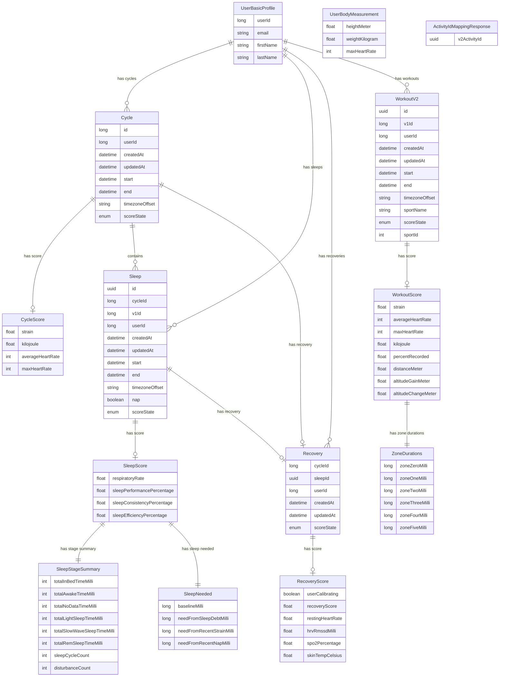

# WHOOP API Data Model

This page documents the entity-relationship model for the WHOOP API v2.0.0, derived from the [OpenAPI specification](../openapi.json). It provides a visual ER diagram showing all domain entities, their attributes, and relationships, along with a textual overview of each domain group.

## Contents

- [ER Diagram](#er-diagram)
- [Domain Overview](#domain-overview)
  - [User](#user)
  - [Cycle](#cycle)
  - [Sleep](#sleep)
  - [Recovery](#recovery)
  - [Workout](#workout)

## ER Diagram

## Domain Overview

### User

The User domain represents the WHOOP member and their physical profile. **UserBasicProfile** contains identity information such as name and email, while **UserBodyMeasurement** tracks physical attributes including height, weight, and maximum heart rate. The user is the central entity — all activity data (cycles, sleeps, recoveries, and workouts) is linked back to a user via their unique identifier.

### Cycle

A **Cycle** represents a single physiological day in WHOOP, spanning from one sleep onset to the next. Each cycle belongs to a user and tracks the time boundaries of that physiological period. When scored, a cycle produces a **CycleScore** containing the day's overall strain (cardiovascular load on a 0-21 scale), kilojoules burned, and heart rate statistics. Cycles serve as the organizing container for sleep and recovery data.

### Sleep

The Sleep domain captures rest activity data. A **Sleep** record represents a single sleep session (or nap) within a cycle, tracking start/end times and whether it was a nap. When scored, a **SleepScore** provides performance and efficiency percentages along with respiratory rate. The score contains a **SleepStageSummary** breaking down time spent in each sleep stage (light, SWS, REM, awake) and a **SleepNeeded** calculation showing baseline sleep need adjusted for strain, sleep debt, and recent naps.

### Recovery

**Recovery** measures how prepared a user's body is to take on strain after sleep. Each recovery is linked to both a cycle and a sleep, representing the body's readiness at the start of a new physiological day. When scored, the **RecoveryScore** provides a recovery percentage (0-100%), resting heart rate, heart rate variability (HRV RMSSD), and optionally SpO2 and skin temperature for users with WHOOP 4.0+ devices.

### Workout

The Workout domain tracks physical activities. **WorkoutV2** records individual workout sessions with start/end times and the sport performed. When scored, a **WorkoutScore** provides strain, heart rate metrics, kilojoules, distance, and altitude data. The score includes **ZoneDurations** breaking down time spent in each of six heart rate zones (zone 0 through zone 5), from very light activity to maximum effort.
